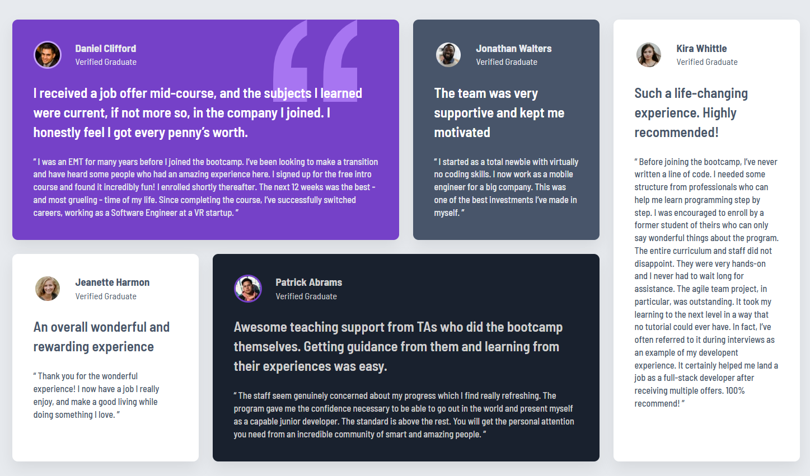
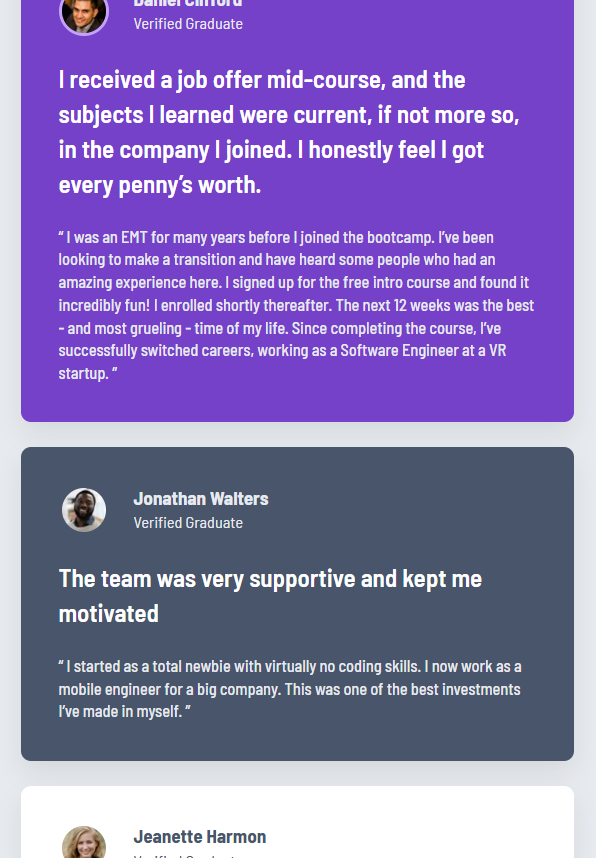

# Frontend Mentor - Testimonials Grid Section


This is a solution to the [Testimonials grid section challenge on Frontend Mentor](https://www.frontendmentor.io/challenges/testimonials-grid-section-Nnw6J7Un7). Frontend Mentor challenges help you improve your coding skills by building realistic projects.

The goal was to build a responsive testimonials section that closely matches the provided design, utilizing **CSS Grid** for the main layout while ensuring perfect visual hierarchy and accessibility.

## Table of contents

- [📸 Overview](#-overview)
  - [The Challenge](#the-challenge)
  - [Screenshot](#screenshot)
  - [Links](#links)
- [🛠️ Built With](#️-built-with)
- [🚀 Key Features \& Implementation Highlights](#-key-features--implementation-highlights)
- [📂 Folder Structure](#-folder-structure)
- [🔧 Local Setup](#-local-setup)
- [📝 What I Learned](#-what-i-learned)
- [📄 License](#-license)
- [👨‍💻 Author](#-author)
- [Acknowledgments](#acknowledgments)

## 📸 Overview

### The Challenge
Users should be able to:
- View the optimal layout for the site depending on their device's screen size (Desktop & Mobile).
- See the design as intended.

### Screenshot



### Links
- **Repository**: [GitHub Repo](https://github.com/Ali-Zol/frontend-mentor-testimonials-grid-section.git)

## 🛠️ Built With

- **Semantic HTML5 Markup** (`<article>`, `<header>`, `<blockquote>`, `<main>`)
- **CSS** – Used HSL colors directly for consistency with the design system.
- **CSS Grid** – Used `grid-template-areas` for precise 4-column desktop layout
- **Flexbox** – Used for aligning avatar images and author details inside cards
- **Desktop-first / Responsive Design** – Adapted layouts via `@media` queries

## 🚀 Key Features & Implementation Highlights

- **Desktop Layout**: Implemented a complex 4-column grid using `grid-template-areas` (Daniel spans 2 columns, Kira spans 2 rows, etc.).
- **Background Quotation Mark**: Applied the SVG quotation image to Daniel's card using `background-image` with precise positioning (`top right`).
- **Avatar Styling**: Added circular avatars with unique colored borders matching the design system (e.g., light purple border for Daniel, white borders for light cards).
- **Mobile Adaptation**: At ≤ 500px, the grid switches to a vertical Flex layout.

## 📂 Folder Structure

```text
/
├── css/
│   └── style.css
├── images/
│   ├── image-daniel.jpg
│   ├── image-jonathan.jpg
│   ├── image-kira.jpg
│   ├── image-jeanette.jpg
│   ├── image-patrick.jpg
│   ├── bg-pattern-quotation.svg
│   └── favicon-32x32.png
├── screenshots/
│   └── desktop-design.jpg
├── index.html
└── README.md
```

## 🔧 Local Setup
To get a local copy up and running, follow these simple steps:
1. Clone the repository
    ```bash
    git clone https://github.com/Ali-Zol/frontend-mentor-testimonials-grid-section.git
    ```
2. Navigate to the project folder
    ```bash
    cd frontend-mentor-testimonials-grid-section
    ```
3. Open the project

    Simply open the `index.html` file in your preferred browser.

## 📝 What I Learned

This project was an excellent exercise in mastering CSS Grid. Using `grid-template-areas` made the layout logic incredibly readable and easy to adjust. I also practiced combining `position: relative` with background images to overlay decorative elements without disrupting the HTML structure.

## 📄 License

This project is open source and available under the [MIT License](LICENSE).

## 👨‍💻 Author

- Ali-Zol - [GitHub](https://github.com/Ali-Zol)

- Frontend Mentor - [@Ali-Zol](https://www.frontendmentor.io/profile/Ali-Zol)

## Acknowledgments
Thanks to the Frontend Mentor community for providing such a great platform to practice real-world projects. If you have any feedback or suggestions, feel free to open an issue or reach out!